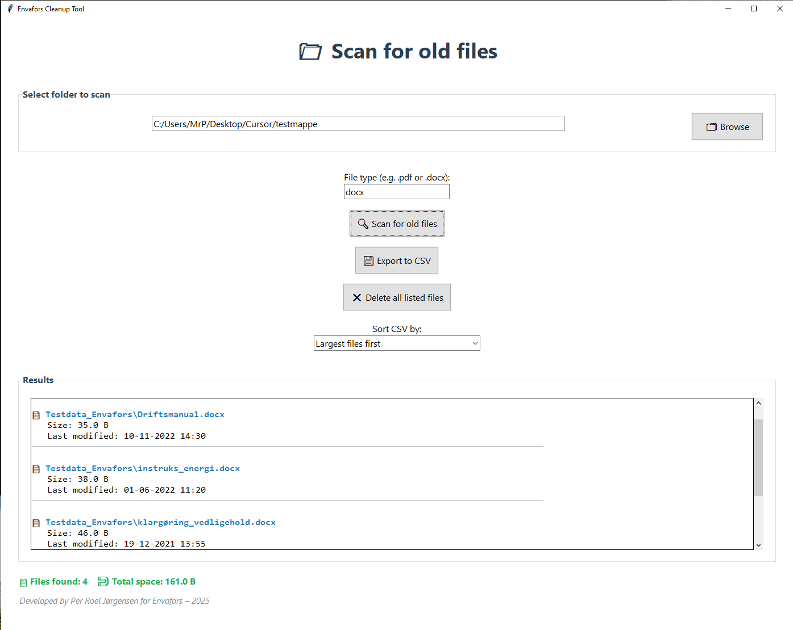

# File Cleanup Tool (Envafors Edition)

This is a graphical Python tool for scanning folders and identifying files older than 90 days.  
It is designed to help users clean up space and get an overview of outdated files quickly and safely.

## 🔧 Features

- Select a folder and scan for files older than 90 days
- Optional file type filter (e.g. `.pdf`, `.docx`)
- Export results to CSV
- Sort by size or last modified date
- Delete all listed files directly from the interface
- Clear summary of total files and total space found
- Built with `tkinter` – no browser or CLI required

## 🖼 Screenshot

## ✅ Technologies Used

- Python 3
- `tkinter` for GUI
- `os`, `csv`, `datetime` for file handling
- Cross-platform (tested on Windows)

## 🧠 Author

Developed by **Per Roel Jørgensen**  
Originally built for internal use at **Envafors**, 2025

## 💡 Usage

1. Clone or download this repository
2. Run `file_cleanup_gui.py` using Python 3
3. Browse to the folder you want to scan
4. Optionally filter by file extension
5. View results and export or delete as needed

## ⚠️ Disclaimer

Use at your own risk – always double-check files before deleting.

